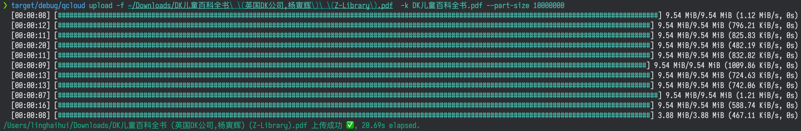

# qcloud

一个操作腾讯云对象存储的命令行工具。

支持文件(夹)的上传，文件下载及删除



## 安装

从[release](https://github.com/bujnlc8/qcloud/releases)下载相应版本

OR

cargo install --path .

## 配置

```sh

# 替换成你的配置
1. mv qcloud.toml.example qcloud.toml

# 将qcloud.toml移动到 $HOME/.config 目录下，也可以通过`QCLOUD_CONFIG_DIR`环境变量来定义配置文件所在的目录
2. mv qcloud.toml $HOME/.config

```

# 使用

```sh
# 上传文件，支持文件夹
# 支持输出下载链接二维码
# 支持多线程上传
# 支持显示进度条
qcloud upload -f 本地文件 [-k 对象key-name]

# 下载文件
qcloud download -k 对象key-name [-f 本地保存文件名称]

# 删除文件
qcloud delete -k 对象key-name
```

更多的参数说明请输入`qcloud --help`查看
